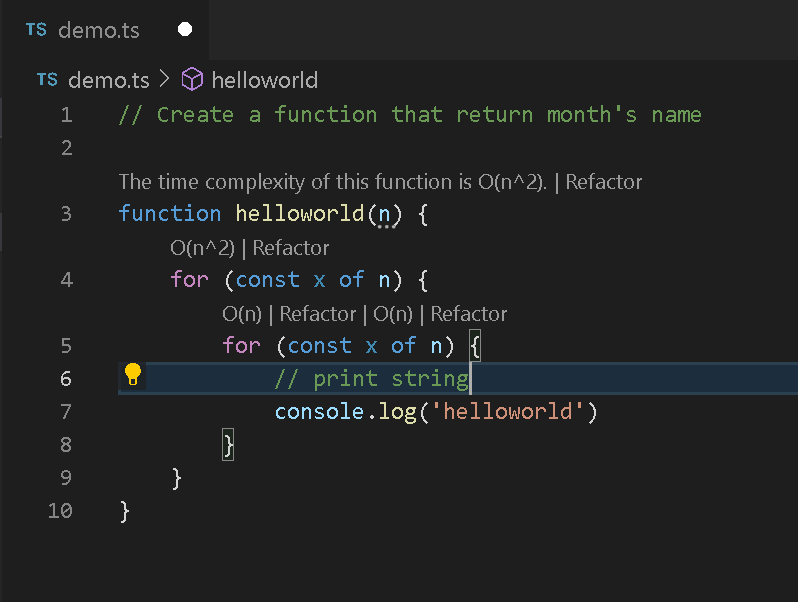
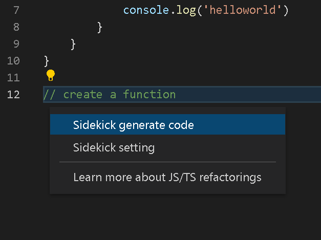
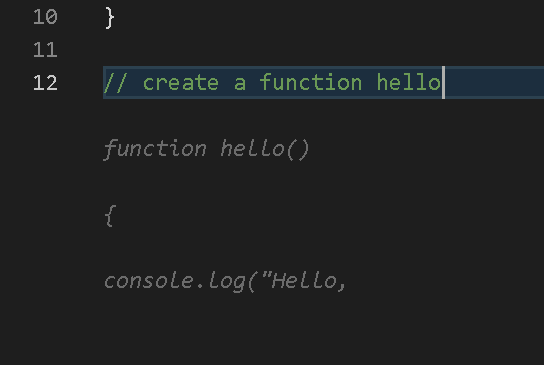
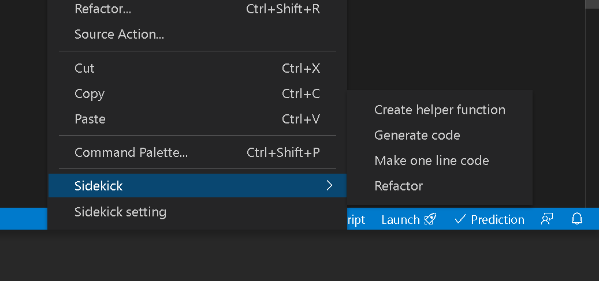

# Sidekick - Visual Studio Code Extension
> A perfect AI Sidekick for a solo leveling developer

### [DevRev Hackathon - Coding with AI](https://devrevhack0.devpost.com)
> Use AI to code and automate Developer tasks

### Notes
This extension is using *Inline Completion* which is a [proposed API](https://code.visualstudio.com/api/advanced-topics/using-proposed-api) so this extension can only run with Visual Studio Code Insider Version.

### Create VSIX for local installation 
Run the npm commands: `npm run vsce-package`

## Displays the complexity of codeblocks

## Code action (yellow lightbulb)

## Inline completion

## Submenu actions for selected text

